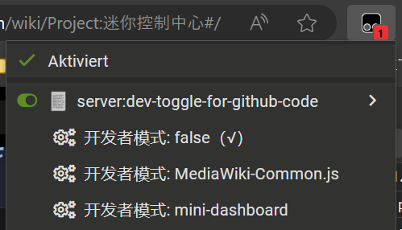

# Dev-Toggle-for-GitHub-Code

一个用于在羊羊百科注入开发服务器切换变量的用户脚本。

## 原理

利用篡改猴插件，在网页加载前注入全局变量`dev`，值为`false`或字符串。普通代码会根据`dev`的值来判断是否加载，在非`false`的情况下由篡改猴脚本加载`http://localhost:5173/src/main.ts`（Vite 开发服务器的默认路径）。

## 使用方法

1. 安装浏览器插件[篡改猴](https://www.tampermonkey.net)。
2. 安装篡改猴脚本：[Dev-Toggle-for-GitHub-Code](https://xyy-huijiwiki.github.io/Dev-Toggle-for-GitHub-Code)。
3. 在羊羊百科的页面上，打开篡改猴菜单，启用脚本（false 代表停止注入开发服务器，不同名称代表不同项目）。



> [!NOTE]
> 结束测试后记得关闭脚本，否则默认js将无法加载。

## 新项目如何接入此脚本

1. 在`src/main.ts`中的`devList`添加项目新项目的名称。
2. 脚本会加载`http://localhost:5173/src/main.ts`，新项目需要视情况调整开发服务器的 host 和 port。
3. 在新项目启动前，通过全局变量`dev`判断是否停止加载代码，比如：

   ```ts
   // src/main.ts
   // 假设是Vite项目且全部为默认设置
   // 假设项目名称为`newProject`

   if (import.meta.env.PROD && dev === "newProject") {
     // 此处代码只在生产环境且发现`dev`值为`newProject`时执行
     // 此时停止继续加载代码即可，剩下的交给篡改猴脚本
     throw new Error("检测到dev环境，停止加载prod代码");
     // 虽然并不推荐throw new Error，但是这是最简单的方法
   }
   ```
